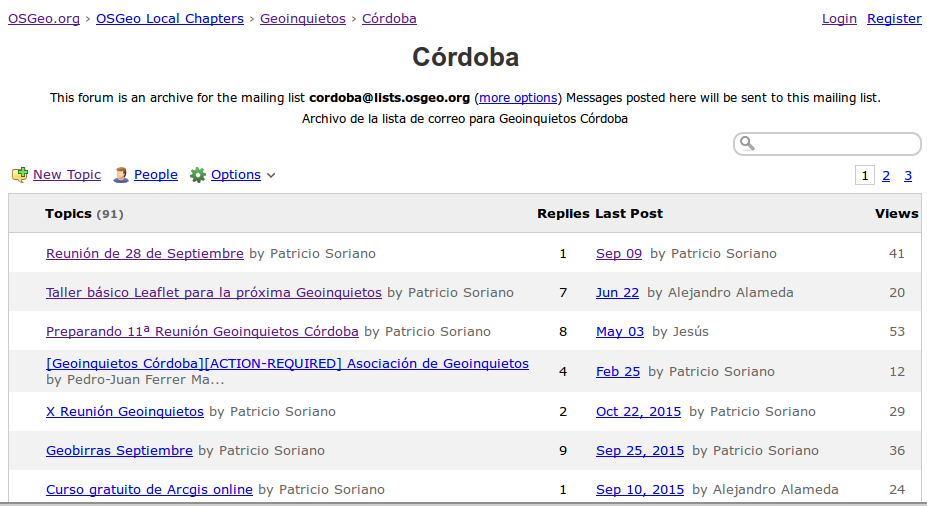
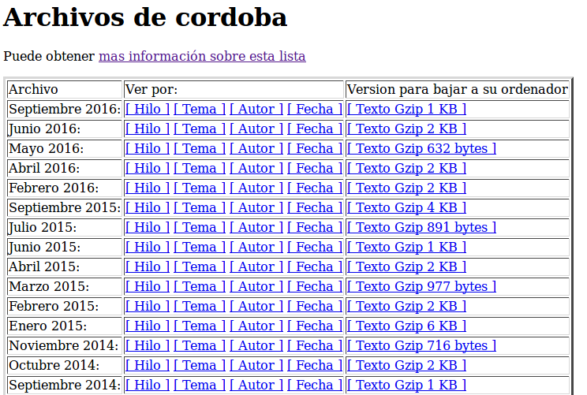

# Alta en la lista de correo de Geoinquietos Córdoba

- Acceder a la siguiente dirección [https://lists.osgeo.org/mailman/listinfo/cordoba](https://lists.osgeo.org/mailman/listinfo/cordoba)

- Completar los datos del formulario
  - Dirección de correo electrónico
  - Nombre (es opcional pero también importante)
  - Clave
- Hacer click en el botón "Suscribir"
- Tras completar estos pasos se un mensaje de correo electrónico pidiendo una confirmación.

# Enviar mensajes

Una vez suscrito a la lista, se puede enviar un mensaje a todos los miembros los miembros de la lista desde cualquier gestor de correo envíánlo a la dirección [cordoba@lists.osgeo.org](cordoba@lists.osgeo.org). 

Para la consulta y gestión on-line se puede usar el foro en nabble.com (http://osgeo-org.1560.x6.nabble.com/Cordoba-f5023342.html) que es un reflejo de la lista de correo. Úsalo si te llevas mejor con los foros que con las listas de correo. Los mensajes que escribas en el foro llegarán a la lista de correo y viceversa.

# Acceso a archivos de la lista

Se puede consultar el historial de mensajes desde esta dirección [https://lists.osgeo.org/pipermail/cordoba/](https://lists.osgeo.org/pipermail/cordoba/)

