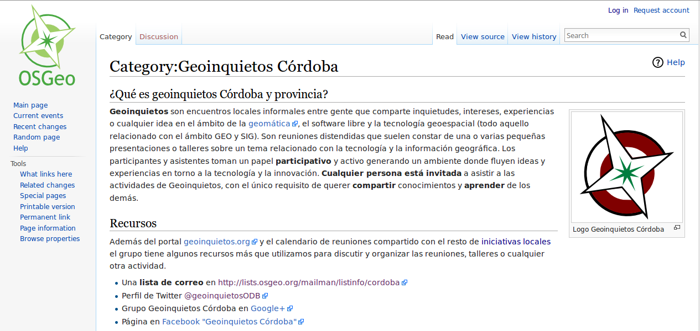
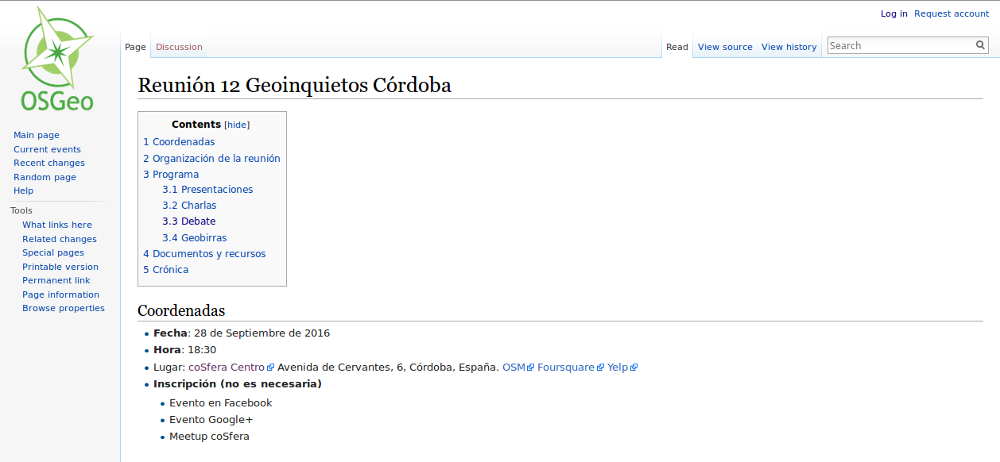
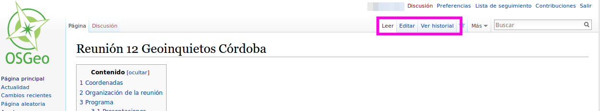
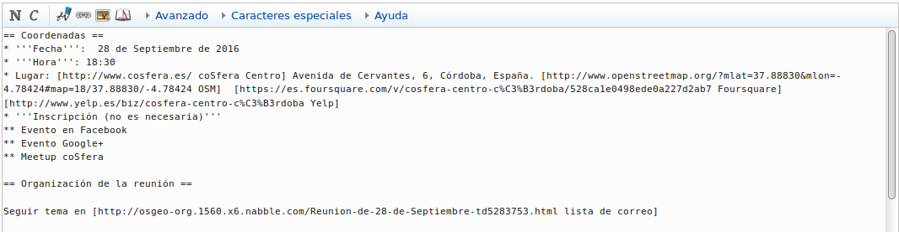
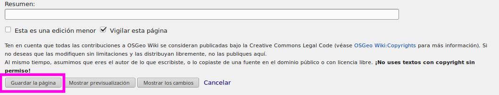

#Editar información en la página wiki de Geoinquietos Córdoba

Como la gran mayoría de los grupos, Geoinquietos Córdoba dispone de un espacio en la wiki de OSGEO dentro de la categoría ["Iniciativas locales"](https://wiki.osgeo.org/wiki/Category:Iniciativas_Locales).

La dirección de la wiki es [https://wiki.osgeo.org/wiki/Category:Geoinquietos_Córdoba](https://wiki.osgeo.org/wiki/Category:Geoinquietos_C%C3%B3rdoba)

La finalidad de la wiki es dejar constancia de las actividades que el grupo realiza con el fin principal de que esta documentación pueda servir a otros grupos o iniciativas o meramente como archivo o acta de las labores del grupo.

##Añadiendo contenidos

Para cada reunión o actividadse abre una página en la wiki en su correspondiente categoría. Por [ejemplo](https://wiki.osgeo.org/wiki/Reuni%C3%B3n_8_Geoinquietos_C%C3%B3rdoba), para las reuniones se crea una página con distintos apartados que ofrezcan la máxima información sobre dónde se realizará la reunión, aistestentes, programa y también datos sobre qué es lo que pasó durante la misma.

Posibles apartados:

- Coordenadas: Fecha, lugar de reunión, páginas relacionadas (FB, Lista, Google+...)
- Asistentes. Listado de asistentes
- Programa
- Información Talleres
- Temas a tratar
- Temas tratados
- Documentos y recursos

Existe unos apartados (asistentes, recursos, resumen, enlaces) que son necesarios completar de forma grupal entre los asistentes por lo que es necesario tener cuenta en la wiki y editarlos.

## Requisitos

El único requisito es darse de alta en la wiki de OSGeo mediante usuario y clave. Para obtener una cuenta ir al siquiente enlace [https://wiki.osgeo.org/wiki/Special:RequestAccount](https://wiki.osgeo.org/wiki/Special:RequestAccount) y completar el formulario.

## Editar página de la reunión

Tras localizar la página a editar, introducimos nuestro usuario/clave en el caso de no habernos "logueado" antes. El acceso se encuentra en la parte superior derecha de todas las páginas de la wiki de OSGeo. Este es el [enlace directo](https://wiki.osgeo.org/index.php?title=Special:UserLogin&returnto=Special%3ARequestAccount).

Tras introducir usuario/clave aparecerá habilitada la pestaña de Editar. 

Haciendo click en la pestaña, pasaremos a modo edición de la página. Para dar formato al texto (encabezamientos, negritas, listas...) o añadir imágenes o enlaces exixte un conjunto de reglas y símbolos usados por regla general en las web tipo wiki.

Por ejemplo:

- Negritas: ...el texto en negritas '''resalta mucho''' sobre todo lo demás...
- Cursiva: ...el texto en cursiva ''resalta un poco menos'' que en negrita...
- Subrayado ...podemos subrayar <u>una parte</u> de la oración...
- Enlace interno:  [[Título de la página|Texto del enlace]]
- Enlace externo: [http://www.example.org Etiqueta del enlace]
- Encabezado de 2.º nivel	== Texto de encabezado ==
- Encabezado de 3.º nivel	== Texto de encabezado ==
- Lista viñeteada * Elemento de la lista
- Lista numerada # Elemento de la lista
- Archivo incrustado [[File:Ejemplo.png|thumbnail|Texto de la leyenda]]

En este formato, el siguiente texto

Se visualizaría de esta forma

Una vez realizado los cambios deben ser guardados. haciendo clik en el botón **Guardar página**

## Subir archivos

## Crear páginas nuevas

